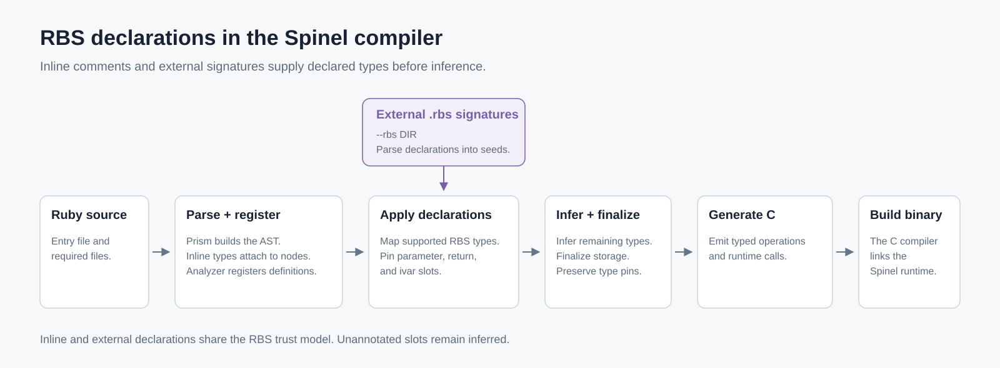

# Inline RBS comments

Spinel reads type annotations from Ruby comments using
[ruby/rbs inline syntax](https://github.com/ruby/rbs/blob/e84e0724656b2ffd1c4f11f893e75b27aadddaf3/docs/inline.md).
Inline RBS is enabled by default; `--no-inline-rbs` disables it.

```ruby
class Bag
  EMPTY = [].freeze

  attr_reader :count #: Integer

  # @rbs @items: Array[Integer]?

  #: (Array[Integer]) -> void
  def initialize(items)
    @items = items
    @count = items.size
  end

  #: () -> Array[Integer]
  def items = @items || EMPTY
end
```

Inline annotations use the [`--rbs`](rbs-extract.md) type mapping and
pinning rules. When both forms apply to a declaration, they produce the
same generated C.
CRuby ignores these comments, so they do not change CRuby's behavior.

## Through the compiler



The parser attaches inline declarations to Ruby AST nodes. The analyzer
registers classes and methods, then applies supported declarations before
inference. External `.rbs` signatures enter the same pinning stage.
Inference determines the remaining types, and the compiler emits C for the
native executable.

## What an annotation does

An applied annotation uses the existing RBS seed trust model:

1. **It asserts a type.** A contradictory value that the compiler can see
   causes a compile error at the store. See
   [Contradictions](rbs-extract.md#contradictions).
2. **A seeded parameter converts its argument** on a dynamic call.
   An incompatible argument raises `TypeError`.
3. **With `-DSP_RBS_CHECK`**, boxed values that narrow into pinned slots
   undergo tag checks. A mismatch aborts the program. See
   [Checking seeds](rbs-extract.md#checking-seeds).

Without these checks, a false annotation that the compiler cannot disprove
can reinterpret a value incorrectly. Write annotations that describe the
program, as with external RBS signatures.

A contradiction names the store and the annotation:

```
spinel: meter.rb:9: inline RBS annotation contradicted: @reading is declared Integer at meter.rb:6 but this assigns String
```

Runtime checks retain the existing `--rbs seed violated` wording. The
compiled program does not retain the annotation's source location.

Unannotated slots remain inferred. Spinel does not replace missing
annotations with ruby/rbs's default `untyped` signatures.

## Supported forms

| Form | Example |
|---|---|
| Leading method signature | `#: (Integer, String) -> bool` |
| No parameters | `#: () -> void` or `#: -> void` |
| Leading `@rbs` signature | `# @rbs (Integer) -> Integer` |
| Indented continuation | `#: (Integer,` followed by `#   String) -> void` |
| Named parameter and return lines | `# @rbs x: Integer`, `# @rbs return: String` |
| Trailing return on a regular method | `def m(x) #: Integer` |
| Leading signature on an endless method | `#: (Integer) -> Integer` above `def m(x) = x` |
| Class method in a class or module | A leading signature above `def self.m` |
| Method modifier | A leading signature above `private def m(x)` |
| Skip a method annotation | `# @rbs skip` |
| Trailing attribute type | `attr_reader :name, :title #: String` |
| Standalone class/module-body ivar | `# @rbs @name: String`, separated from the next declaration by a blank line |

The supported types match `--rbs`: `Integer`, `Float`, `String`, `Symbol`,
`bool`, `nil`/`void`, `untyped`, program classes, `Array[T]`, `Hash[K, V]`,
`T?`, unions as boxed values, and `singleton(C)`. See
[Type vocabulary](rbs-extract.md#type-vocabulary).

A method uses one signature: a method type or named parameter and return
lines. Method-type parameters match Ruby parameters by position and keyword
name. Required positional parameters and keywords, including optional keywords,
can receive pins.
A Ruby block parameter without an RBS block declaration remains inferred.

## Where an annotation attaches

- Leading comments must form a consecutive block at the same column,
  immediately above the declaration. A blank source line breaks attachment.
  Ordinary comments can share the block. Indented text continues an RBS line.
- Methods must belong to a static `class` or `module` declaration.
  This includes reopened declarations and `def self.m` inside them.
- A trailing `#:` return attaches to the line that ends a regular method's
  parameter list. An endless method needs a leading signature.
- Attribute types attach only after the `attr_reader`, `attr_writer`, or
  `attr_accessor` call. Leading types do not annotate attributes.
- A class-body `# @rbs @x: T` applies only when its block is standalone
  and the class/module body contains Ruby statements. Annotation-only bodies
  have no analyzer node for the declaration and warn without a pin.
  A following method, attribute, or constant consumes an adjacent block
  without an ivar pin. Separate the ivar block with a blank source line.
- Top-level methods, `class << self`, non-self singleton receivers, and
  dynamic `Class.new`, `Struct.new`, or `Data.define` bodies receive no pins.
  Explicit-receiver `C.class_eval` blocks receive no pins. Receiverless
  `class_eval` inside a static declaration retains that declaration's context.
- Spinel reads the entry file and required Ruby files as it parses them.
  It does not read Ruby files from an `--rbs` directory or comments inside
  source strings passed to `class_eval`.

These placements follow the
[ruby/rbs visitor](https://github.com/ruby/rbs/blob/e84e0724656b2ffd1c4f11f893e75b27aadddaf3/lib/rbs/inline_parser.rb)
and its
[attachment tests](https://github.com/ruby/rbs/blob/e84e0724656b2ffd1c4f11f893e75b27aadddaf3/test/rbs/inline_parser_test.rb).
In particular, the tests leave endless-method trailing returns untyped.

## Diagnostics and limitations

An error stops compilation. Unsupported signatures never apply only some
of their types. Warnings leave annotations unapplied, except that an
overridden return can remain inferred while supported parameter types apply.

| Situation | Response |
|---|---|
| Malformed RBS annotation | Error with the parser's message and source position |
| Two signatures for one method, or duplicate parameter annotations | Error naming both locations |
| Conflicting applied inline or external declarations | Error naming both locations |
| Unseedable types: literals, interfaces, tuples, records, procs, `self`/`instance`/`class`, type variables | Warning; ignore the whole annotation |
| Unknown program class, such as `Time` or `Array[Time]` | Warning naming the type as written; ignore the whole annotation |
| Optional positional, rest, trailing, rest-keyword, or RBS block parameters | Warning; ignore the whole signature |
| Overloads, `...`, generic method signatures, and superclass/mixin type arguments | Warning; ignore the annotation |
| Constants and type/module declarations that have no analyzer pin | Warning; ignore the annotation |
| Unattached annotations and unsupported placements | Warning with the reason; no pin |
| Return of a method overridden by a related class | Warning; leave the return inferred and apply supported parameter types, as with `--rbs` |
| Module methods copied through `include`, `extend`, or `prepend` | Warning; no pin reaches those per-class copies, as with `--rbs` |
| Annotated method replaced by a later unannotated or unsupported definition | Warning naming the replacement; ignore the original annotation |

A `module_function` or `extend self` method can receive a pin because its
function serves every caller. Other module methods copied into classes
need separate analyzer support.

Warnings use this format:

```
spinel: FILE:LINE:COL: warning: inline RBS: ... is not applied: ...
```

The column identifies the comment's `#`. Type names retain their source
spelling.

Prose, RDoc directives such as `#:nodoc:`, ordinary documentation tags,
magic comments, and `# spinel:` directives are not annotations. Strings,
heredocs, regexps, and `=begin`/`=end` blocks do not supply annotations.

The compiler links the vendored ruby/rbs 4.0.1 grammar after `make deps`.
A build without that parser warns once and skips inline annotations.

## With `--rbs`

Inline and external signatures can coexist. Declarations for the same slot
must agree. Agreement produces the same C as either declaration alone;
disagreement stops compilation and names both locations.

This also applies to annotated methods in reopened classes. Comparison
uses the full type: `Array[Foo]` differs from `Array[Bar]`, and `Integer`
differs from `Integer?`. Ignored annotations do not participate.

Conflicting external `.rbs` declarations fail before comparison with inline
annotations. An inline annotation does not select between them.

## Turning it off

`--no-inline-rbs` disables inline parsing, pins, and diagnostics.
External `--rbs` signatures still apply. Use this option when source
annotations are not trusted to describe the compiled program.

## What a signature buys

An annotation gives the compiler a type inference could not find. Where
inference already has the type it changes nothing; where it does not, a
slot that was a boxed value -- a tagged value every operation on which is
dispatched at run time -- becomes the declared C type.

`benchmark/bm_rbs_items.rb` is one such call site. `Bag#items` returns
`@items || EMPTY`, and some bags hold no array, so without its
`#: () -> Array[Integer]` the `.size` in the hot loop compiles to
`sp_poly_size`, a dispatch on a boxed value; with it, to
`sp_IntArray_length`. `make bench-rbs` (`tools/rbs_bench.rb`) builds that
program without RBS, with the annotation, and with the same signature
through `--rbs`, and beside them `benchmark/bm_rbs_items_control.rb`, the
same loop over a method inference already types precisely. On one Linux
x86-64 machine, gcc 14 at `-O2`, 21 interleaved runs of 200 million
iterations each (load average about 5 on 32 cores):

| Build | Hot `.size` | Binary bytes | `.text` bytes | Median s | Min s | Max s |
|---|---|---:|---:|---:|---:|---:|
| no RBS (`--no-inline-rbs`) | `sp_poly_size` | 359,448 | 198,834 | 0.955 | 0.858 | 1.053 |
| inline annotation | `sp_IntArray_length` | 354,816 | 195,826 | 0.589 | 0.585 | 0.605 |
| same signature via `--rbs` | `sp_IntArray_length` | 354,816 | 195,826 | 0.591 | 0.586 | 0.601 |
| control | `sp_IntArray_length` | 350,600 | 194,674 | 0.173 | 0.169 | 0.185 |

The inline and `--rbs` builds are the same C, byte for byte, and the
control's C is the same with its annotation and without. Every build's
stdout, stderr and exit status equal CRuby's. The unannotated build is also
the noisy one: its runs spread from 0.86 to 1.05 s where the annotated ones
stay within 4%, and its fastest run is still slower than the annotated
builds' slowest. The distance left between the annotated loop and the
control is `@items || EMPTY` itself: the instance variable is still a boxed
value inside `items`, and is unboxed at the return.

These numbers describe one loop on one machine. They show what one
signature does to one call site; they are not a measure of how much faster
a program gets, which depends on how much of its time is spent in slots
inference could not type.
